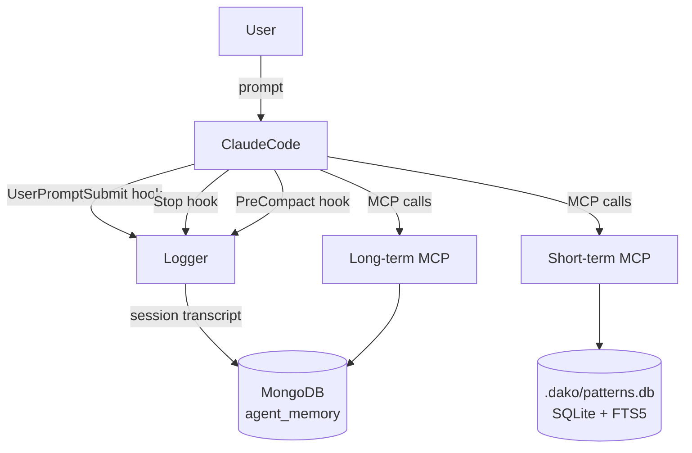

# Architecture

## Component map

```
DakoHarness/
├── .claude-plugin/
│   └── plugin.json             Plugin manifest (name: "dako", version, author)
├── commands/                   Plugin commands — available as /dako:<name> (20 total)
│   ├── recall.md               Memory commands
│   ├── promote.md
│   ├── promote-team.md
│   ├── session-end.md
│   ├── registry-refresh.md
│   ├── setup.md                /dako:setup — full first-time project setup (MongoDB, .env, .mcp.json, CLAUDE.md)
│   ├── wi-start.md             Workitem workflow — unified drivers
│   ├── wi-next.md
│   ├── wi-status.md
│   ├── wi-park.md
│   ├── wi-cancel.md
│   ├── wi-intake.md            Workitem workflow — individual phases
│   ├── wi-analyze.md
│   ├── wi-propose.md
│   ├── wi-plan.md
│   ├── wi-implement.md
│   ├── wi-review.md
│   ├── wi-document.md
│   ├── wi-repo.md
│   └── wi-archive.md
├── hooks/
│   └── hooks.json              Plugin hook configuration (UserPromptSubmit, Stop, PreCompact)
├── bin/                        Auto-added to PATH by plugin system
│   ├── logger.mjs              Legacy copy — not used by hooks (kept for compatibility)
│   ├── dako-logger             Unix wrapper: calls mcps/mongodb-memory/logger.mjs via $DIR/../
│   ├── dako-logger.bat         Windows wrapper
│   ├── dako-stm                Unix wrapper: detects OS via uname, execs platform binary
│   ├── dako-stm.bat            Windows wrapper → dako-stm.exe
│   ├── dako-stm.exe            Short-term MCP binary (Windows amd64)
│   ├── dako-stm-linux          Short-term MCP binary (Linux amd64)
│   └── dako-stm-darwin         Short-term MCP binary (macOS amd64)
├── mcps/
│   ├── mongodb-memory/         Long-term memory MCP (Node.js + TypeScript)
│   │   ├── server.ts           MCP server (remember, recall, get_context, promote_to_team,
│   │   │                         forget, archive_workitem, …)
│   │   └── logger.mjs          Dev setup copy (standalone use with .claude/settings.json)
│   └── short-term-memory/      Short-term pattern memory MCP source (Go + SQLite)
│       └── main.go             MCP server (remember_pattern, find_patterns, get_recent_patterns)
├── .claude/
│   ├── settings.json           Hook configuration for standalone DakoHarness dev setup
│   ├── skill-registry.md       Auto-generated skill index (gitignored)
│   └── commands/               Dev-setup commands (mirrors commands/ — for local dev use)
├── workitem/                   Workitem traceability artifacts
│   └── WI-<feature>/
│       ├── source_of_truth.md  Overall workitem state
│       └── <date>-<sub>/       Sub-feature folder
│           ├── intake.md
│           ├── analyze.md
│           ├── approaches.md
│           ├── plan.md
│           ├── implementation.md
│           ├── review.md
│           └── documentation.md
├── claude-plugin-release/      Self-contained marketplace submission package
├── setup.sh / setup.ps1        Manual infrastructure setup scripts (--plugin-dir installs)
├── .mcp.json                   MCP server registrations (relative paths — resolved from plugin root)
├── CLAUDE.md                   Agent instructions, memory protocol, workitem protocol
└── README.md                   Project documentation
```

---

## Data flow



---

## MCP servers

| Server | Language | Storage | Scope | TTL |
|---|---|---|---|---|
| `dako-long-term-memory` | Node.js | MongoDB | Project or Team | Permanent |
| `dako-short-term-memory` | Go | SQLite (FTS5) | Project, machine-local | 7 days |

---

## Hook pipeline

| Hook | Trigger | Action |
|---|---|---|
| `UserPromptSubmit` | User sends a message | Log user turn to MongoDB `messages` |
| `Stop` | Agent finishes responding | Log assistant turn from JSONL transcript |
| `PreCompact` | Context compression starts | Save last 3 assistant turns as compaction snapshot |

**Plugin hook resolution:** `hooks/hooks.json` calls `dako-logger <event>`. The plugin system adds `bin/` to PATH, so `dako-logger` resolves to `bin/dako-logger` (Unix) or `bin/dako-logger.bat` (Windows). The wrapper calls `node "$DIR/../mcps/mongodb-memory/logger.mjs"` — `$DIR` is the wrapper's own directory, so the path resolves to the MCP server's logger regardless of cwd.

---

## Session state file

`.claude/.dako_session` persists across hook invocations:

```json
{
  "session_id": "<dako-uuid>",
  "claude_session_id": "<claude-conversation-uuid>"
}
```

When `claude_session_id` changes (new conversation), a fresh DakoHarness session is created automatically. See [[Session Logging#Session boundary detection]].

---

## MongoDB collections

| Collection | Contents |
|---|---|
| `memories` | Long-term memories (decisions, conventions, bugs, context, lessons) |
| `sessions` | One document per conversation |
| `messages` | All conversation turns ordered by `seq` |
| `workitems` | Archived completed workitems (wi_path, project, username, git_commit, documentation) |

---

## Related

- [[Memory System]] — how the two tiers work
- [[Session Logging]] — hooks in detail
- [[Workitem Workflow]] — development workflow and artifact structure
- [[Setup Guide]] — wiring it all up
